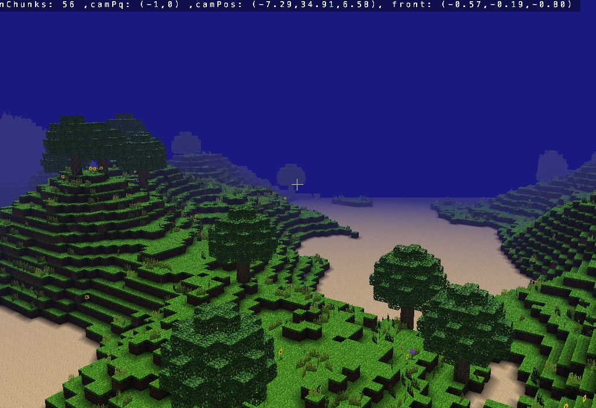

# Craft Cpp
## Description
Procedural voxel terrain generation using Perlin noise.



- *Author:* Niccolò Pozzetti
*note: this is a **c++** porting from [Craft](https://github.com/fogleman/Craft)*

## Dependencies
### Mandatory
- C++ compiler and linker (tested on gcc, clang, visual studio)
- CMake
- X11 libs (only on unix like systems): more details at [link](https://www.glfw.org/docs/latest/compile.html)
  - on debian based distros: `sudo apt install xorg-dev`
### Optional
- Doxygen (for documentation)
- gcovr (for coverage info)
- valgrind (*only for linux*, for leaks check)

## How to build
1. Make a directory (usually called *build*) where you want to store
build tool configuration files
2. tell cmake to generate build tool configuration files into that
directory
3. *optional* indicate what type of build you want
4. launch your build tool 

Bash example using makefile for Release build type (assuming your current working
directory is the one where there is the *CMakeLists.txt* file of this project):
```bash
mkdir build
cd build
cmake -DCMAKE_BUILD_TYPE=Release ..
make
```

*note: launching executables from visual studio ide does not work,
but launching it directly from the file system works*

### Available build types
- **Release** the most optimized build type, not good for debugging
- **Debug** not optimized, adds coverage info and debug info
- **Address_Sanitizer** debug build plus address sanitizer flags
  - only available for linux
- **Undefined_Sanitizer** debug build plus undefined behavior sanitizer flags
  - only available for linux
- other build types may be available by default, but thy shouls not be used

### Available executables
- **app** interactive demo
- **catch_test** wrapper for tests written with catch2 library.

### Available Targets
- `build` build all targets (*app* and *catch_test*)
- `install` creates a *bin* directory into project root (where CMakeLists.txt is located)
and copies the executable *app* into *proj_root/bin/build_type/*
  - calling this target implicitly calls `build` before
- `test` launches *catch_test* executable
- `doc` generates documentation in *proj_root/doc/doxygen*
- `coverage` generates coverage html info in *proj_root/doc/coverage*
  - this target is only available on linux
  - this target should not be called with *Release* build
- `valgrind` check memory for leaks and saves log in "proj_root/doc" 
  - this target is only available on linux
  - this target should not be called with *Release* build
  - executing valgrind is computationally very expensive

### Report
Report pdf is available in report directory 